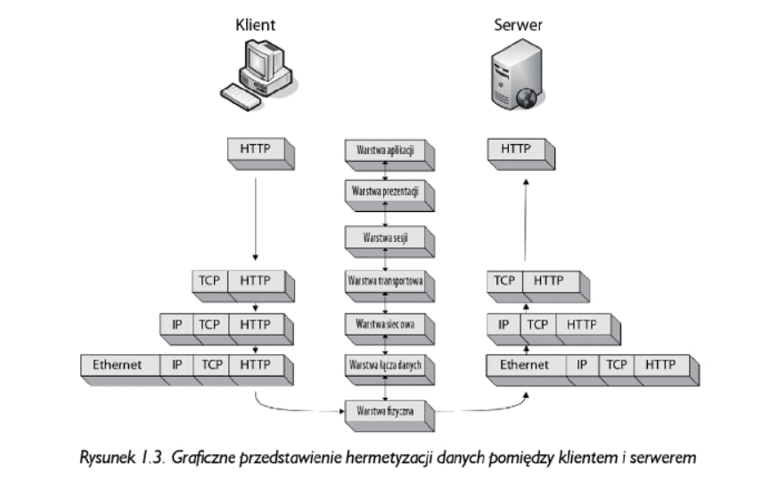
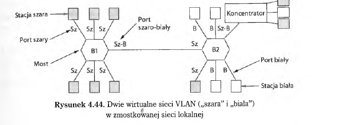

# Computer Network

## Model OSI

**Warstwa aplikacji (7)** - Najwyższa warstwa to tak naprawde program, który pozwala użytkownikowi uzyskać dostęp do zasobów sieciowych.To najczęściej jedyna warstwa dostępna dla użytkownika końcowego.
**Protokoły**: HTTP, SMTP, FTP

**Warstwa prezentacji (6)** - Warstwa konwertuje otrzymana dane na format zrozumiały dla użytkownika w warstwie aplikacji. Obsługuje kilka form szyfrowania i deszyfrowania stosowanych w celu zabezpieczenia danych.
**Protokoły:** ASCII, MPEG, JPEG

**Warstwa sesji (5)** - warstwa da oznacza dialog, inaczej sesję pomiędzy dwoma komputerami. Jest odpowiedzialna za połączenia pomiędzy wszystkimi komunikującymi się komputerami (nawiązywanie połączeń, zarządzanie nimi, zamykanie ich). Odpwiada także za rodzaj połączenia (półduplex, duplex).Odpowiada także za eleanckie zakończenia połączenia zamiast nagłego zerwania.
**Protokoły:** NETBIOS, SAP, SDP

**Warstwa transportowa (4)** - Podstawowtym celem tej warstwy jest zapewnienie niezawodnych usług transportu danych do warstw niższych. Poprzez kontrolę przepływu, segmentacje danych(dzielenie na segmenty) i ponowne łączenie oraz kontrolę błędów gwaratnuje przekazanie bezbłędnych danych do punktu docelowego. Niektóre zapory sieciowe i serwery proxy działają w ramach tej warstwy.
**Protokoły:** TCP, UDP

**Warstwa sieciowa (3)** - Warstwa ta jest odpowiedziala za kierowanie danymi pomiedzy fizycznymi sieciami. Odpowiada za logiczne adresowanie komputerów (np. adresy IP). Na poziomie tej warstwy działają routery.
**Protokoły**: IP, IPX

**Warstwa łącza danych (2)** - warstwa zapewnia transport pomiędzy fizycznymi sieciami. Jej podstawowym zadaniem jest dostarczenie schematu adresów, który może służyć do identyfikacji urządzen w sieci np. adresy MAC. Przełączniki to rodzaje urządzeń, które występują w warstwie 2.
**Protokoły:** Ethernet, Token Ring, FDDI, ARP

**Warstwa fizyczna (1)** - warstwa jest fizycznym nośnikiem za pomocą którego przesyłane są dane w sieci. Specyfikacje napięcia okablowania i takie tam. Warstwa fizyczna nawiązuje i zamyka połączenia, konwertuje sygnał z postacji
analogowej na cyfrową i na odwrót.

Proces **hermetyzacji** to dodawanie do transmitowanych dancyh nagłowka lub stopki, są to informacje dzięki którym sąsiadujące warstwy są w stanie się komunikować.
Gdy pakiet idzie z warstwy aplikacji to tworzy się tzw. **PDU (Protocol Data Unit)**, wraz z przechodzeniem przez każdą warstwę, PDU rośnie. Gdy dochodzi do warstwy fizycznej
wszystko wysyła się do drugiego urządzenia, a to urządzenie przesyła pakiet w górę, usuwając jednocześnie dane odnoszące się do tej warstwy.

## Protokoły

### ARP

-   określenie nazwy za pomocą protokołu ARP wymaga użycia jedynie dwóch pakietów: żądania ARP i odpowiedzi ARP
-   RFC to dokument definiujący standardy implementacji protokołów
-   komputer nadawcy wysyła żądanie ARP do każdego komputera w domenie rozgłoszeniowej, żądanie ma swój adres IP, swój adres MAC oraz adres IP odbiorcy
    następnie pyta się wszystkich komputerów czy ktoś ma może taki adres IP. Jeden z komputerów odpowiada adresem MAC
-   urządzenia do których nie pasuje adres IP odrzucają ten pakiet

### TCP

-   głównym celem protokołu TCP jest niezawodne dostarczanie danych
-   do komunikacji używamy portów z zakresu 1024 - 65535

**Trzyetapowy proces nawiązywania połączenia**

1. W pierwszym kroku urządzenie, które chce nawiązać komunikacje wysyła pakiet TCP do urządzenia docelowego. Pakiet początkowy nie zawiera danych, a jedynie nagłówki protokołu warstwy niższej.
   Ten nagłówek ma ustawioną flagę na SYN i przekazuje początkowy numer sekwencyjny oraz maksymalną wielkość segmentu, które będą używane w procesie komunikacji
2. Drugi komputer odpowiada podobnym pakietem z ustawioną flagą na ACK/SYN oraz początkowym numerem sekwencyjnym.
3. Na koniec pierwszy komputer wysyła do drugiego pakiet z flagą ACK. Po tym urządzenia mogą się komunikować.

**Proces zakończenia połączenia**

1.W pierwszym kroku komputer A informuje komputer B o zakończeniu połączenia poprzez wysłanie pakietu TCP z ustawionymi flagami **FIN i ACK**

2.Komputer B odpowiada pakietem **ACK** i wysyła własny pakiet **FIN/ACK**

3.Komputer A odpowada pakietem **ACK**

### UDP

-   celem utworzenia UDP było przyspieszenie transmisji danych
-   jest to protokół bezstanowy
-   formalnie nie wykorzystuje operacji nawiązywania i zakończenia połączenia
-   najczęściej protokły opare na UDP mają własne, wbudowane mechanizmy zapewniające niezawodność lub używają pewnych funkcji ICMP w celu ich zapewnienia
-   np. protokoły DNS i DHCP używają UDP jako protokołu warstwy transportowej, po ich stronie spoczywa odpowiedzialność na tym aby kontrolować pakiety i przesyłać je ponownie jeśli jest taka potrzeba

## Media transmisyjne

**10BASE-T** - standard Ethernetowy, który pozwala urządzeniom siciowym na komunikacje z wykorzystaniem skrętki. Przewidywana prędkość to 10 Mb/s.

Wyjaśnienie:

-   10 - prędkość
-   BASE - przesłanie sygnału w paśmie podstawowym bez modulacji
-   T - skrętka

**100BASE-TX** - tzw. fast Ethernet, maks prędkość to 100Mb/s. Medium transmisyjnym jest skretka nieekranowa UTP lub FTP zakończona obustronnie złączem 8P8C.

**1000BASE-TX/FX** - prędkość 1 Gigabit/s.

Zakres częstotliwości przenoszonych bez silnego tłumienia nazywamy **szerokością pasma**. Szerokość pasma jest fizyczną właściwością nośnika transmisjij zależną na przykład od konstruklcji kanału, czyli choćby od grubości i długośći przewodów czy śwatłowodów. Np. kanały sieci bezprzewodowych 802.11 mogą zajmować pasmo o szerkości mniej więcej 20MHz.

**Skrętka (twisted pair)** - najbardziej popularnym zaastosowaniem skrętki jest system telefonnii. Można wykonywac również połączenia z internetem (ADSL). Sygnał za pomoca tego medium można przeysłać nawet na odległość kilku kilometów jednak na dłuszą metę potrzebne będa regeneratory. Gdyby nie skręcanie kabelków, kable zakłócałyby się nawzajem. Skrętką można przesyłać sygnał analogowy jak i cyfrowy.

**UTP** - skrętka nieekranowa. Ekranowanie zmniejsza podatność na zakłócenia oraz przesłuchy.

**Standardy skrętki**:

-   U/UTP – skrętka nieekranowana
-   F/UTP – skrętka foliowana
-   U/FTP – skrętka z każdą parą w osobnym ekranie z folii.
-   F/FTP – skrętka z każdą parą w osobnym ekranie z folii dodatkowo w ekranie z folii
-   SF/UTP – skrętka ekranowana folią i siatką
-   S/FTP – skrętka z każdą parą foliowaną dodatkowo w ekranie z siatki
-   SF/FTP – skrętka z każdą parą foliowaną dodatkowo w ekranie z folii i siatki

**Kabel koncentryczny** - ma szersze pasmo niż nieekranowa skrętka. Pozwala na przesylanie sygnału z większą szybkością niż skrętka.

**Światłowody** - zapewnia jednokierunkowy system transmisjji danych, który przejmuje sygnał elektryczny, przekształca go i przesyła w postaci impulsów światła, a następnie ponownie przekształca wyjscie na sygnał elektryczny po stronie odbiornika.

## Urządzenia

### Warstwa fizyczna:

**Wzmacniak (repeater)** - urządzenia analogowe operujące na sygnałach przesyłanych kablami., do których są podłączone. Sygnał odebrany z jednego kabla jest oczyszczany, wzmacniany i propagowany do drugiego kabla. Wzmacniaki nie rozumieją ramek, pakietów i nagłówków.

**Koncentrator (hub)** - ma pewną liczbę linii wejściowych, które łączy elektrycznie. Ramki pojawiające się w dowolnej linii są wysyłane do wszystkich pozostałych. Działa w trybie półduplesku, czyli nie może jednocześnie odbierać i wysylać danych.
Przykład: do koncentratora, który ma 4 porty mamy podłączone 4 urządzenia. Komputer z portu 2 chce wysłać dane do komputera
na porcie numer 1. Wysyła również te dane do komputerów na portach 3 i 4, klienci na tych portach sprawdzają docelowy adres MAC
zawarty w nagłówku Ethernet i odrzucają to połączenie. To rozwiązanie generuje dużo niepotrzebnego ruchu sieciowego. Hub implementuje magistrale.

**Modulacja cyfrowa** - proces konwersji bitów na reprezentujące je sygnały analogowe. Urządzenie używane do tego to **modem (Modular Deemulator)**

**Koder-dekoder** - urządzenie słuzące do przetwarzania sygnałów analogowych na na cyfrowe.

### Warstwa łącza danych

**Most** - posiada wiele portów. Inaczej niż w koncentratorze każdy z portów jest odizolowany od innych, a więc **wyznacza odrębną domene kolizyjną**. Jeśli port posiada pełnodupleksową linie dwupunktową, nie potrzebuje stosować algorytmu dostępu wielokrotnego CSMA/CD. Gdy do mostu przychodzi ramka, wydobywa on adres docelowy z jej nagłówka i szuka go w tablicy aby sprawdzić gdzie przesłac ramkę. Most przekazuje ramkę tylko na ten port gdzie powinna trafiić

**Przełączniki** - nowoczesne mosty. Został zaprojektowany w tym samym celu co koncentrator. Jednak w przeciwienstwie do koncentratora wysyła dane tylko do komputera dla którego są one przeznaczone. W celu indentyfiikacji komputerów przełącznik odróżnia komputery na
na podstawie adresów MAC, działa więc na warstwie 2. Może działać w trybie pełnego dupleksu.

Pytania:

-   Przełącznik LAN realizuje funkcję mostu.
-   Przełączniki stosują algorytm STA (Spanning Tree Algorithm)
-   Przełącznik rozszerza domenę rozgłoszeniową

### Warstwa sieciowa

**Router** - gdy pakiet dociera do routera, nagłowek i stopka ramki są usuwane, a pakiet mieszczący się w polu ładunku użytecznego ramki jest przekazywany do oprogramowania routingu. W pakiecie IP nagłówek zawiera 32 - bitowy (Ipv4) lub 128 - bitowy (IPv6) adres 802.

### Warstwa transportowa

**Brama** - łączy ona dwa komputery używające odmiennych połączeniowych protokołów transportowych. Załóżmy, że komputer używający połączeniowego TCP/IP chce komunikować się z komputerem używającym innego protokołu połączeniowego o nazwie SCTP. Brama może kopiować pakiety z jednego połączenia do drugiego, w razie potrzeby zmieniając ich format.

## Wirtualna sieć lokalna VLAN

Wirtualne sieci lokalne buduje się z użyciem odpowiednich przełączników. Aby zestawić sieć opartą na VLAN, administrator decyduje, ile sieci lokalnych będzie używanych, które komputery będa należeć do konkretnych z nich i jakie będa nazwy tych sieci. Aby wirtualna sieć mogła działać prawidłowo, należy skonfugurować tablice konfiguracyjne w mostach. Tablice te informują, które VLANY są dostępne przez które porty.

Przykładowa sytuacja: Jedna z szarych stacji podłączonych do mostu B1 wysyła ramkę do adresata, który jeszcze nie zgłosił się do mostu i nie wiadomo gdzie się znajduje. Most odbierze tę ramkę zobaczy że pochodzi ona z szarej wirtualnej sieci lokalnej, więc roześlę ramkę tylko do stacji szarych oraz do innego mostu. Po stronie drugiego mostu będzia miała miejsce analogiczna sytuacja.

Procesy warstwy fizycznej oraz część procesów warstwy łącza danch działają w dedykowanych urządzeniach sprzętowych, określanych łącznie mianem kart interfejsów sieciowych **NIC (Network Interface Card)**

**Wysyłanie ramki przez warstwe łącza danych** - gdy warstwa łącza danych przejmuje pakiet, kapsułkuje go ramkę przez dodanie do niego nagłówka i stopki łącza danych.

**Ramka (frame)** składa się z czterech pól: kind, seq, ack i info, z których pierwsze zawierają informacje kontrolne, a ostatnie może zawierać faktcyzne dane do przesłania. Pola kontrolne noszą nazwę nagłówka ramki.

**Protokoły z oknem przesuwnym** - kwintesencją protokołów z oknem przesuwnym, jest to że w każdej chwili nadajnik pamięta zbiór numerów sekwencyjnych odpowiadających ramkom, które ma prawo wysłać. Mówimy że ramki te mieszczą się w **oknie nadawczym** . Podobnie odbiornik utrzymuje **okno odbiorcze** odpowiadające zbiorowi ramek, które ma prawo przyjąć. Wielkość okna jest w nagłówku segmentu TCP i oprócz tego, że określa, jaka ilość danych może zostać wysłana bez potwierdzenia, pozwala jeszcze na sterowanie przepływem danych pomiędzy urządzeniami. Jeśli na kliencie nastąpi zator w przyjmowaniu danych i dany segment zostanie utracony, urządzenie to może wysłać informacje do serwera, o zmniejszeniu wielkość tego okna, czyli ilość danych mogących zostać odebranych bez potwierdzenia, spowalnia to transmisje, ale zapobiega utracie segmentów. Po pewnym czasie wielkość okna przywracana jest to tej początkowej. Zmiana wielkości okna podczas transmisji nazywana jest **dynamicznym oknem lub oknem przesuwnym**.

**SONET** to protokół warstwy fizycznej wykorzystywany przede wszystkim w rozległych sieciach na bazie okablowania światłowodowego, składających się na sieci szkieletowe sieci telekomunikacyjnych, w tym sieci szkieletowe systemów telefonicznych. Zapewnia **strumień bitów** o dobrze ustalonej przeustowości.

**ATM (Asynchronous Transfer Mode)** to warstwa łącza danych oparta na transmisji komórek informacji o ustalonym rozmiarze. Słowo asynchroniczny oznacza, że komórki NIE muszą być nadawane stale, w postaci nieprzerwanego strumienia bajtów ładunku tak jak w SONET.

**SDH** - czyli synchroniczna hierarchia systemów cyfrowych. Jest to technologia sieci transportu informacji, charakteryzujący się tym , że wszystkie urządzenia działające w sieci SDH, pracujące w trybie bezawarjnym są zsynchronizowane zarówno do nadrzędnego zegara jak i do siebie nazwajem (W odróżnieniu do ATM)

**NEXT** - przesłuch zbliżny. Jest to zakłócenie generowane w parze na skutek transmisji sygnału w sąsiedniej parze. Współcynnik NEXT(Near End CrossTalk) jest mierzony jako stosunek amplitudy napięcia testowego do napięcia wyindukowanego w sąsiednej parze. Miarą są decybele.

## Działanie 802.11

Sposób dostępu do medium przypomina CSMA/CD stosowany w standardzie IEEE802.3 tzn kolizje są typowym zachowaniem sieci. Zmiany jakie wprowadzono do tego schematu działania wynikają z „niepewności nośnika” i sprowadzają się do:

1. ponieważ nigdy nie jesteśmy pewni czy odbiornika ramki jest w zasięgu zastosowano technikę pozytywnego potwierdzenia: większość ramek musi być potwierdzone ramką ACK jej brak wymusza automatyczne ponowienie transmisji (mogą pojawić się ramki zduplikowane u odbiorcy)

2. Stacja, która z powodzeniem rozpoczęła transmisję informuje w każdym pakiecie jaki czas rezerwuje na transmisję: jest to tzw **Wektor Alokacji Sieci (NAV – NetworkAlocation Vector)** a pozostałe stacje przeliczają ten czas niezależnie (mogą być chwilowo poza zasięgiem)

3. W przypadku kiedy w sieci istnieją stacje które się „nie widzą” aby się wzajemnie nie zakłócały stosuje się sekwencję RTS (Request to Send – nadaje stacja rozpoczynająca transmisję u ucisza stacje w swoim zasięgu) – CTS (Clear to Send – stacja do której
skierowana była ramka RTS odpowiada CTS uciszając stacje w swoim zasięgu) po czym rozpoczyna się transmisja Najważniejszą ramką zarządzającą w sieciach 802.11 jest ramka **Beacon** rozsyłana jest w stałych odstępach czasu przez punkt dostępowy **AP** lub w sieci „Ad Hoc” przez stację która w pewnym przedziale czasowym wylosuje najkrótszy offset. Losowanie ponawiane jest za
każdym razem kiedy przychodzi czas na wysłanie ramki **Beacon**

### Zawartość ramki Beacon

* Timestamp - stempel czasowy do synchronizacji
* Channel information – Informacja na temat kanału
* Data Rates – podstawowy i inne wspierane szybkości transmisji
* Service Set capabilities – dodatkowe parametry dla BSS lub IBSS
* **SSID** – nazwa sieci
* TIM (Traffic Indication Map) – informacja na temat buforowanych ramek dla stacji
będących w trybie oszczędzania energii
* VPI (Vendor Proprietery Information) – Informacje zależne od producenta sprzętu
Typowo ramka Beacon jest rozsyłana 10 razy na sekundę.

Dodatkowo ramka danych odczekuje interwał **DIFS**

## Bezpieczeństwo 802.11

Standard 802.11, określany pierwotnie mianem 802.11i, opisuje protokół zapobiegania odczytowi komunikatów wymienianych pomiędzy parą inych węzłów sieci bezprzewodowej albo ingerowaniu w nie. Rzecz znana również pod nazwą **WPA2 (Wi Fi protected Access 2)**. Stosowane wcześniej **WPA** to mechanizm skromniejszy, stanowiacy implementację podzbioru standardu 802.11i - preferowanym mechanizmem jest obecnie WPA2.

**WPA2** stosuje się typowo w dwóch przypadkach: pierwszy obejmuje wdrożenia korporacyjne, gdzie wyróżniono serwer uwierzytelniania z bazą użytkowników i haseł umożliwiających werfikacje, czy dany user może dostać dostęp do sieci. Alternatywą jest tutaj **EAP(Extensible Authentication Protocol)** opisujący sposób interakcji pomiędzy klientem, a serwerem uwierzyelniania.

Drugi scenariusz to przypadek instalacji domowej, gdzie nie ma wyróznionego serwera uwierzytelniania. Zamiast tego mamy pojedyczne wspólne hasło dostępowe

Pytanie: Czy 802.1X oraz 802.1i wykorzystują EAP? **TAK**

## Protokoły routingu

Internet jest zbudowany z dużej liczby systemów niezależnych albo **AS (Autonomous Systems)** zarządzanych przez różne organizacje (korporacje, uczelnie i operatorów sieciowych).

**OSPF (Open Shortest Path First)** - protokół routingu wewnętrznego. Do znajdowania najkrótszej trasy używa algorytmu Dijkstry.

**RIP** - wczesny protokół routingu wewnętrznego opierający się na wektorze odległości.Do utworzenia metryki stosuje się jedynie liczbę przeskoków (liczba kolejnych routerów na danej trasie). Używa UDP jako protokołu warstwy transportowej.
Maksymalna liczba skoków w **RIP 2** wynosi 15.

**EIGRP** - hybrydowy protokół trasowania operuący na algorytmie wektora odległości. Ma fragmentaryczną wiedzę o strukturze sieci.

**BGP (Border Gateway Protocol)** - w obrębie jednego systemu autonomicznego AS routing załatwiają najczęściej protokoły OSPF i IS-IS. Ale pomiędzy AS-ami króluje inn protokół o nazwie BGP - protokół bram granicznych.

## Bluetooth

Standard bezprzewodowej komunikacji krótkiego zasięgu pomiędzy różnymi urządzeniami elektronicznymi, takimi jak klawiatura, komputer, laptop, palmtop, smartfon i wieloma innymi.
Jest to otwarty standard opisany w specyfikacji IEEE 802.15.1. Jego specyfikacja techniczna obejmuje trzy klasy mocy nadawczej ERP 1-3 o zasięgu 100, 10 oraz 1 metra w otwartej przestrzeni. Najczęściej spotykaną klasą jest klasa druga. Standard korzysta z fal radiowych w paśmie częstotliwości ISM 2,4 GHz.
Do wymiany danych stosuje dwa typy łączy **SCO** oraz **ACL**.
Bluetooth wkorzystuje **FHSS**

**FHSS (Frequency-Hopping Spread Spectrum)** – metoda rozpraszania widma w systemach szerokopasmowych. W tłumaczeniu wprost jest to „skakanie” sygnału po częstotliwościach w kolejnych odstępach czasu, w dostępnym widmie (paśmie). Spotykana również w sieciach Wi - Fi.

## Access Point

Urządzenie zapewniające hostom dostęp do sieci komputerowej za pomocą bezprzewodowego nośnika transmisyjnego jakim są fale radiowe.

Punkt dostępowy jest zazwyczaj mostem łączącym bezprzewodową sieć lokalną (VLAN) z siecią lokalną (LAN). W związku z tym punkt dostępowy musi posiadać co najmniej dwa interfejsy sieciowe:

-   bezprzewodowy działający w oparciu o standard IEEE 802.11 (Wi-Fi)
-   przewodowy służący połączeniu AP z siecią standardu IEEE 802.3 (Ethernet) bądź modem standardu DSL

Access point rozgłasza **SSID**

**SSID (service set identifier)** – identyfikator sieci składający się maksymalnie z 32 znaków, dodawany do nagłówków pakietów wysyłanych przez bezprzewodową sieć lokalną. Pełni on rolę loginu przy próbie nawiązywania połączeń z punktami dostępowymi. Urządzenia, które łączą się z danym punktem dostępowym, korzystają z przypisanego do niego identyfikatora SSID.

### Typy sieci bezprzewodowych z wykorzystaniem AP

**BSS (Basic Service Set)** - jeśli stacje chcą przesyłać dane między sobą, mogę to robić tylko za pośrednictwem AP. W związku z tym każda stacja musi znajdować się w pobliżu punktu dostępowego, więc zasięg sieci jest równy zasięgowy AP.

**ESS (Extended Service Set)** - powstaje w wyniku połączenia kilku BSS-ów za pomocą sieci szkieletowej. W takiej sieci stacje mogą przemieszczać się pomiędzy różnymi BSS-ami bez utraty połączenia. Na obszarze sieci ESS możliwy jest **roaming**.

## Polecenia w systemie Linux

**Netstat** - wyświetla połączenia sieciowe, tablice tras, statystyki interfejsów, połączenia masquerade i członkostwa multicast. Raportuje o pracy TCP/UDP.

**Nslookup** - narzędzie działające podobnie do protokołu DNS, zwraca adres IP żądanego endpointu oraz adres serwera. Po wybraniu opcji z autoryzacją można otrzymać bardziej szczegółowe informacje

**ifconfig** - służy do sprawdzania i zmieniania intefejsów sieciowych.

**traceroute** - służy do badania trasy pakietów w sieci

**ping** - służy do diagnozowania połączeń sieciowych. Wykorzystuje ICMP.

## Adresacja IPv4

Adres IP to adres interfejsu sieciowego, nie urządzenia.

**Adres podsieci**:

Adres -- Maska --> operacja AND

**Adres rozgłoszeniowy**:

(Maska --> NOT -- Adres) --> Operacja OR

**Adres pierwszego hosta**:

Gdy adres sieci 192.168.11.15 -> pierwszy host 192.168.11.16

**Adres ostatniego hosta**:

Gdy adres rozgłoszeniowy 192.168.11.255 -> ostatni host 192.168.11.254

**Podział sieci na podsieci**:

Podział na podsieci odbywa się poprzez pożyczanie kolejnych bitów z części hosta w masce podsieci.

255.255.255.0 -> 1 podsieć

255.255.255.128 -> 2 podsieci. Pożyczony został 1 bit pierwszy od lewej czyli 27.

Ilość podsieci = 2 pożyczona liczba bitów

### IPv6

-   Długość adresu: 128 bitów
-   Brak sumy kontrolnej w nagłówku w odróżnieniu od IPv4
-   Nie używa ARP
-   Adres hosta zajmuje 64 bity

## Różne

<b style="color:red">Domena kolizyjna - </b> jeśli poprzez jedno medium transimsyjne np. kabel , co najmniej dwa urządzenia transmitują dane może dojść do kolizji. Obszar sieci, w którym może dojść do kolzji nazywamy domena kolizyjną. Maksymalna liczba urządzeń w domenie kolizyjnej to 1024. Przy czym im więcej urządzeń, tym większe ryzyko wystąpienia kolizji. Domenę kolizyjna mogą ograniczać switch (przełącznik) oraz router.  
W koncentratorze ( warstwa 1 OSI) wszystkie podłączone stacje składają się na domenę kolizyjną. Wszystkie zatem muszą korzystać z alogrytmu _CSMA/CD_ w celu uporządkowania transmisji.
W przełączniku każdy port stanowi oddzielną domenę kolizyjną. Algorytm CSMA/CD NIE jest potrzebny.

<b>Domena rozgłoszeniowa </b> - to taki obszar sieci, do którego dotrze informacja przeslana z jednego komputera do wszystkich inych - broadcast. Coś jak wysłanie pakietu discover w procesie DORA DHCP. Ruch domeny rozgłoszeniowej jest przekazywany poprzez urządzenia pierwszej i drugiej warstwy modelu OSI tj. koncentratory, mosty, huby czy switche. Te urządzenia zwiększają obszar domeny rozgłoszeniowej. Ograniczają go natomiast urządzenia trzeciej warstwy - routery. Można również utworzyć sieć VLAN, która ograniczy zakres domeny rozgłoszeniowej. Urządzenia są w tej samej domenie rozgłoszeniowej jeśli mają taką samą podsieć, bramę domyślna i są w tej samej VLAN.
**Pytanie**: LAN = zasięg domeny rozgłoszeniowej.

<b>IEEE 802.11 - </b>standard bezprzewodowych sieci lokalnych (Wi Fi).

**IEEE 802.3 (Ethernet)** -najpopularniejszy typ przewodowych sieci lokalnych. Każdy z komputerów komunikuje się z użyciem protokołu Ethernet z urządzeniem zwanym **przełącznikiem**, z którym ustanawia połączenie dwupunktowe. Przełacznik posiada wiele portów, z których każdy jest połączony do jednego komputera. Zadaniem przełącznika jest przkazywanie pakietów pomiędzy podłączonymi komputerami na bazie adresów osadznych w pakietach.

**Algorytm routingu/ algorytm trasowania** - wyznaczanie najkrórtszej ścieżki pomiędzy routerami.

**VPN (Virtual Prisvate Network)** - sieć wykorzystywana w korporacjach, gdzie zdalni użytkownicy pracuja z domów na niezabezpieczonych łączach. Zapewnia szyfrowanie.

**Siec Ad Hoc** - sieć w której przyłączone urządzenia mogą pełnić zarówno rolę klienta, jak i Access Pointa.

**CSMA (Carrier Sense Multiple Access)** - algorytm arbitrażowy. Rozwiązuje problem kolizji w sieci 802.11. Polega na tym, że komputer chcący nadawać oczekuje na losowy adres przed transmijsą, a jeśli w czasie transmisji wykryje innego nadawcę, odstępuje od niej i znów czeka losowy okres.

**WEP** - schemat szyfrowania połączenia w sieci 802.11. Polegał na kryptograficznym odizolowaniu transmijsi pomidzy klientami. Schemat był jednak niedpracowany i został zostąpiony przez WPA, a następnie przez WPA2.

**Big endian** - to forma zapisu danych, w której najbardziej znacząct bajt jest ustawiany jako pierwszy.

**NAT (Network Address Translation)** - polega na tym, że operator ISP przydziela każdemu domostwu albo firmie pojedynczy adres IP. Wewnątrz sieco klienta każdy komputer otrzymuje unikatowy adres IP używany do komunijacji wewnętrznej. Gdy jednak pakiet od któregoś z hostów sieci wewnętrznej ma zostać przekzany do sieci operatora, odbywa się translacja adresu z unikatowego wewnętrznego adresu IP na adres publiczny wspólny dla całej sieci wewnętrznej.

**MIMO (Multiple Input Multiple Output)** - technologia działająca w sieciach 802.11abgn. Urządzenia MIMO są zdolne do ciągłego przetwarzania każdego ze składników sygnału wielościeżkowego i mogą np.: zapobiegać nakładaniu się składowych sygnału będących w przeciw-fazie, skutkującego zniekształceniem sygnału. Poprawne działanie takiego systemu zakłada wykorzystanie kilku zupełnie różnych technik radiowych. Co ważne, niektóre z tych technik oferują korzyści i są kompatybilne z urządzeniami działającymi w starszych standardach 802.11a/b/g, pozostałe wymagają urządzeń zgodnych ze standardem 802.11n po obu stronach linku.

**NAS (Network Attached Storage)** - Serwer NAS, czyli Network Attached Storage to nic innego jak niewielki komputer pełniący rolę dysku sieciowego. Dostęp do danych znajdujących się na NAS możliwy jest ze wszystkich urządzeń znajdujących się w sieci lokalnej – oczywiście pod warunkiem posiadania odpowiednich uprawnień. Serwery NAS umożliwiają ograniczenie dostępu do określonych danych, co zwiększa bezpieczeństwo poufnych informacji. **Access Point** pełni funkcję serwera NAS.

**ARPANET (Advanced Research Projects Agency Network)** – pierwsza sieć rozległa oparta na rozproszonej architekturze i protokole TCP/IP. Jest bezpośrednim przodkiem Internetu. Istnieje do dziś.

**IPsec** - zbiór protokołów służących implementacji bezpiecznych połączeń oraz wymiany kluczy szyfrowania pomiędzy komputerami. Protokoły tej grupy mogą być wykorzystywane do tworzenia Wirtualnej Sieci Prywatnej (ang. VPN. Połączenie jest szyfrowane za pamocą algorytmów. Działa w dwóch trybach **transportowym** oraz **tunelowym**. IPv6 posiada zintegrowany IPsec.

**ICANN** - to ogranizacja odpowiedzialna za przydzielanie nazw domen internetowych, ustalaniem ich struktury oraz ogólny nadzór nad działaniem serwerów DNS na całym świecie. Odpowiada również za numery AS -ów.

**OFDM (Orthogonal Frequency-Division Multiplexing)** – metoda zwielokrotnienia w dziedzinie częstotliwości polegająca na jednoczesnej transmisji wielu strumieni danych na ortogonalnych częstotliwościach nośnych.

**802.16 (WiMAX)** - technika bezprzewodowej, szerokopasmowej transmisji danych. Używa **16QAM**

**Bod** - miara określająca prędkość przesyłania **zmian medium transmisyjnego** (nazwanych symbolami) z wykorzystaniem cyfrowej modulacji sygnału 

**Szereg fouriera** - jest wykorzystyawany do zmiany sygnału cyfrowego na analofowy (_Analiza_)
